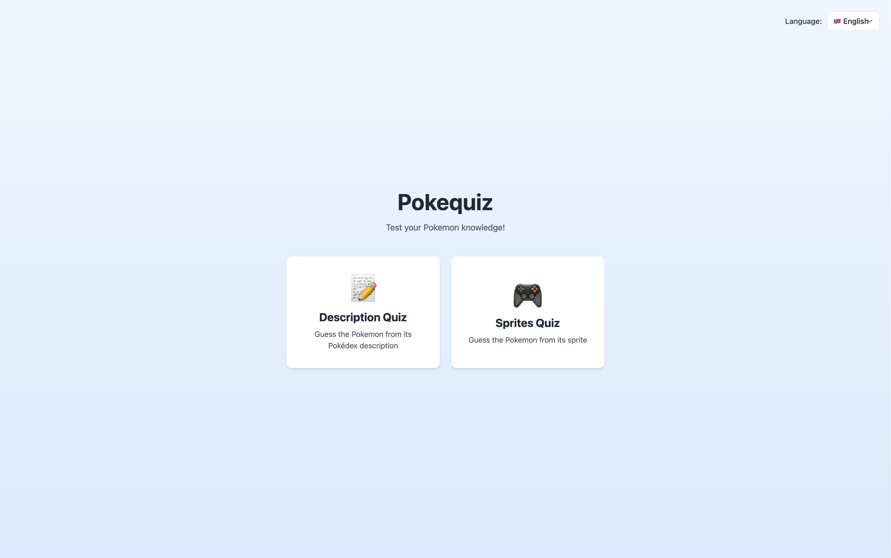
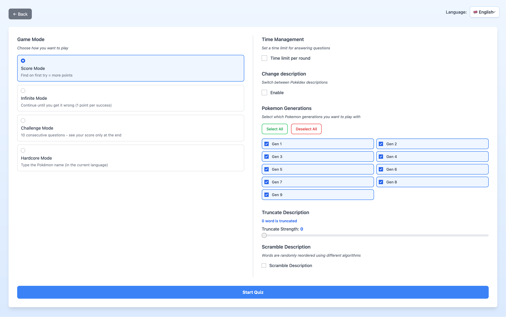
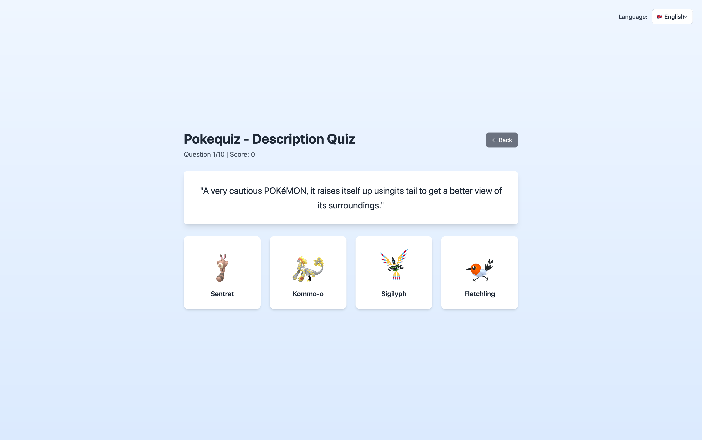
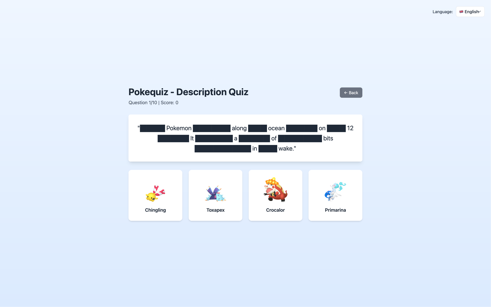

# Pokequiz

Test your Pokémon knowledge with multiple quiz modes and customizable difficulty levels.

---

## Table of Contents

- [Stack](#stack)
- [Features](#features)
- [How to Build and Play](#how-to-build-and-play)
- [Contributing](#contributing)
- [License](#license)
- [Special Thanks](#special-thanks)

---

## Stack

**Frontend:**
- [Svelte 4](https://svelte.dev/) - Reactive UI framework
- [TypeScript](https://www.typescriptlang.org/) - Type-safe JavaScript
- [Vite](https://vitejs.dev/) - Lightning-fast build tool
- [Tailwind CSS](https://tailwindcss.com/) - Utility-first CSS

**Backend:**
- [Node.js](https://nodejs.org/) - JavaScript runtime
- [Express.js](https://expressjs.com/) - Web framework
- [TypeScript](https://www.typescriptlang.org/) - Type safety

---

## Features

- **📝 Description Quiz** - Guess the Pokémon from its Pokédex description
- **🎮 Sprites Quiz** - Guess the Pokémon from its sprite image
- **🎯 Multiple Game Modes**
  - Score Mode - 10 rounds, be as accurate and fast as possible
  - Infinite Mode - Quiz without limits, only your skills
  - Challenge Mode - 10 rounds with final review (like an exam)
  - Hardcore Mode - Limited lives and no hints
- **🌍 Multi-language Support** - English, French, Spanish, German, Italian, Japanese, Korean, Chinese (Simplified & Traditional)
- **⚙️ Customizable Settings**
  - Time limit per rounds
  - Select specific Pokémon generations (Gen 1-9)
  - Word truncation difficulty levels
  - Word scrambling option
  - Multiple sprite sources
  - Visual effects (pixelate, blur)

And more features to come! I'm thinking on addings new quiz modes, more customization options, and improving the overall experience.



<details> <summary><b>More screenshots</b></summary>





</details>

---

## How to Build and Play

### Prerequisites

- Node.js 18+ and npm

### Installation

```bash
# Clone the repository
git clone https://github.com/TheHyrox/Pokequiz.git
cd Pokequiz

# Install dependencies
npm install
```

### Development

Run both client and server in development mode with hot-reload:

```bash
npm run dev
```

This will start:
- **Client**: http://localhost:5173 (Vite dev server, you must go on this one)
- **Server**: http://localhost:3000 (Express server)

## Contributing

We welcome contributions! Here's how you can help:

### Reporting Issues

Found a bug or have a feature request?
- [Open an issue](https://github.com/TheHyrox/Pokequiz/issues/new) with a clear description
- Include steps to reproduce bugs
- Suggest improvements and new features

### Submitting Pull Requests

Want to contribute code?
1. Fork the repository
2. Create a feature branch (`git checkout -b feature/newquiz`)
3. Make your changes
4. Commit your work (`git commit -m 'Add new quiz mode'`)
5. Push to your branch (`git push origin feature/newquiz`)
6. [Open a Pull Request](https://github.com/TheHyrox/Pokequiz/pulls) with a description of your changes

### Development Guidelines

- Write TypeScript
- Follow existing code structure and naming conventions
- Test your changes before submitting

---

## License

This project is licensed under the [Apache License 2.0](LICENSE) - see the LICENSE file for details.

---

## Special Thanks

- [PokéAPI](https://pokeapi.co/) for providing the Pokémon data
- [Sneaze](https://www.youtube.com/@Sneaze) for his "Starter à l'aveugle" (or "Blind pick a starter") series, which inspired the idea of these quiz
